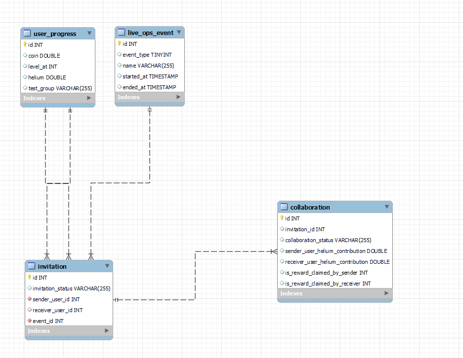

# Dr. GS

I'm currently learning reactive programming with WebFlux and this is my first study of this topic.

The advantage of using this paradigm is using less threads, non-blocking asynchronous IO, streaming with backpressure which over all helps to build more scalable applications.

Please inspect the code I am using Mono.zip(), Flux.merge() etc. which makes the code more efficient.(Parallelism)

Below is the database schema of this project:

## Work Flows

### 1.User Progress

#### 1. GetUserRequest: Parameters: [Integer userProgressId]

If the user does not exist return "customerNotFound" exception. 

Return the entity based on the "userProgressId".

#### 2. CreateUserRequest: Parameters: [TestGroup testGroup]

Create the UserProgress entity based on the provided "testGroup" and default values.

Return the saved entity.

#### 3. UpdateLevelRequest: Parameters: [Integer userProgressId, Instant timestamp]

If the user does not exist, return "customerNotFound" exception.

First find the userProgress entity by "userProgressId" and apply level-up() procedure.

Then, if the timestamp is between 08:00 and 22:00 (UTC) and the user is at least 50 level,
then apply rewardHeliumConditionally() procedure.

Finally save the updated entity into database in a non-blocking way as always and return the saved entiy to client.

### 2.Pop The Balloon Event

For all of the requests below first check the followings: 

- if the "timestamp" is not between 08:00 and 22:00 (UTC) then return IllegalDate() exception.
- if the "eventId" is not 1(default and unique entity for this demo) then return IllegalEvent() exception.
- After finding the UserProgress entity based on the "userProgressId", if the level is below 50 then return levelInsufficient() exception.

#### 1. GetSuggestionsRequest: Parameters: [Integer userProgressId, Integer eventId, Instant timestamp]

If the requester is already matched, then return RequesterAlreadyCollaborated() exception.

Definition of "available" users: Users that are at least 50 level with the same testGroup and that have not matched already for this event and that have not rejected the requester for this event and that have not been sent invitation for this event by the requester yet. 

I am actually collecting all users from db into memory because I have to make suggestions randomized which I think I can improve on. What I mean is, I should not have .collectList() call for all possible suggestions.

Basically return this "available" users as a randomized list to client.

While writing this I discover that there is ORDER BY RAND() LIMIT 10; command in MYSQL which I could have used but I do not have time for this for now. So this endpoint can be improved massively. I can get rid of .collectList() call all together.

#### 2. GetInvitationsRequest: Parameters: [Integer userProgressId, Integer eventId, Instant timestamp]

If the requester is already matched, then return RequesterAlreadyCollaborated() exception.

Return list of 'PENDING' Invitations object received where the receiver is "userProgressId".

I was going to return pageable object but I did not have enough time to do. But it is an easy upgrade and more performant.

#### 3. InvitePartnerRequest: Parameters: [Integer senderUserProgressId, Integer receiverUserProgressId, Integer eventId, Instant timestamp]

If the requester(sender) is already matched, then return RequesterAlreadyCollaborated() exception.

If the requested(receiver) is already matched, then return RequestedAlreadyCollaborated() exception.

Create and save the Invitation object whose status is 'PENDING' and return this saved entity to the client.

#### 4. RejectPlayerRequest: Parameters: [Integer invitationId, Integer receiverUserProgressId, Integer eventId, Instant timestamp]

First find the Invitation entity by invitationId and update the status of this entity from 'PENDING' to 'REJECTED'.

Return the updated Invitation object to the client.

#### 5. AcceptPlayerRequest: Parameters: [Integer invitationId, Integer receiverUserProgressId, Integer eventId, Instant timestamp]

Most important and complicated endpoint.

If the requester(receiverUserProgressId) is already matched, then return RequesterAlreadyCollaborated() exception.

If the requested(sender) is already matched, then return RequestedAlreadyCollaborated() exception.

First find the Invitation entity by invitationId and update the status of this entity from 'PENDING' to 'APPROVED'.

Then trigger the creation of the Collaboration entity with default values.

Then, most importantly, update 'PENDING' invitations sent by these two users to 'INVALIDATED' so that the receivers of these invitations should not see them anymore.

Return the updated and saved Invitation + Collaboration object to the client.

Please inspect the returned DTO object. 

#### 6. GetBalloonsInfoRequest: Parameters: [Integer userProgressId, Integer invitationId, Instant timestamp]

Find the Invitation entity and Collaboration entity by invitationId and return the  Invitation + Collaboration object to the client.

The parameter "userProgressId" is used in differentiating the "requesterHeliumContribution" and "requestersFriendHeliumContribution" in the response.

Please inspect the returned DTO object.

#### 7. UpdateBalloonProgressRequest: Parameters: [Integer userProgressId, Integer invitationId, Instant timestamp, Double consumedHelium]

If the balloons is already burst, then return BalloonAlreadyInflated() exception.

If the requester does not have as much parameter "consumedHelium" as, then return InsufficientHelium() exception.

After, edges cases and math calculations are done.(Some details here)

If the capacity of the balloon is reached, then the status of the collaboration switches from 'IN_PROGRESS' to 'COMPLETED' and now partners have a right to claim the reward. 

The available helium count of the requester and requester's contribution are also updated accordingly.

Returns the updated and saved Invitation + Collaboration object to the client.

The testGroup is respected in the implementation.

Maybe I should return the updated userProgress information as well but no enough time. This can be done added easily.

#### 8. ClaimRewardRequest: Parameters: [Integer userProgressId, Integer invitationId, Instant timestamp]

If the balloons is not ready to burst, then return BalloonNotFullyInflated() exception.

If the requester already has taken the reward, then return EventRewardAlreadyTaken() exception.

After, determine whether the requester has a right to claim the reward and update accordingly.

Update UserProgress entity as adding up the helium reward.

Save the updated entities and return the Invitation + Collaboration object to the client.

There are some catchy control of flow in the code, please inspect it.

The testGroup is respected in the implementation.

### 3.Global Leaderboard

#### 1. GetLeaderboardRequest: Parameters: [Integer userProgressId]

"userProgressId" is used for determining the associated test group with the requester.

Returns a flux of UserProgress.

A hot publisher with sink for both test groups is implemented.

Every 5 seconds, leaderboard is retrieved from the database in a non-blocking way. (Subscribed this source internally.)

Then that flow of data is pushed into the sink which can store up to 100 elements in its internal queue. So that whenever a subscription is made to the Sink, this stored 100 elements are sent immediately.

When I think, the levels of the users are most probably distributed normally. So top100 leaderboard may not change frequently. I should have actually implemented a system where it detects whether top100 is changed upon a level-up event and only then I should make a get request to db.
But unfortunately I did not have enough time.